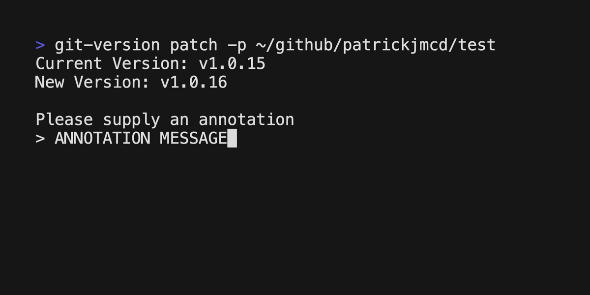

# Git Version

A command-line tool for interacting with the semantic versioning tags of a git repository.

## Installation

```bash
$ go install github.com/patrickjmcd/git-version@latest
```

## Usage

### Commands

There are three commands available to increment the version of a git repository:

- `major` - Increments the major version
- `minor` - Increments the minor version
- `patch` - Increments the patch version

### Options

- `-p, --path` - The path to the git repository to increment the version of. 
Defaults to the current working directory.
- `-l, --label` - The label to use for the version tag (i.e. TESTING -> v1.0.0-TESTING). 
Defaults to no label. Only applicable to the `patch` command.

## Demo

Created with [VHS](https://github.com/charmbracelet/vhs)

